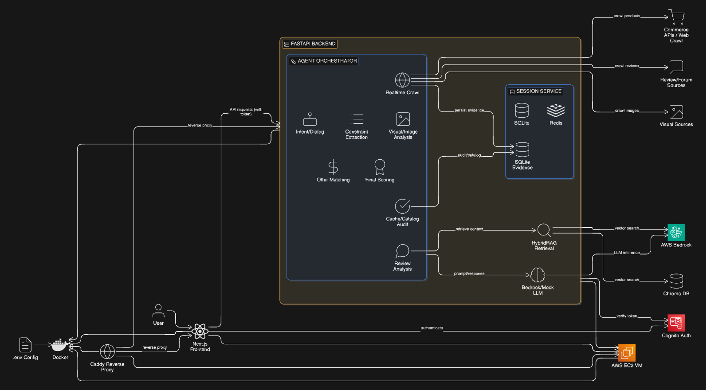
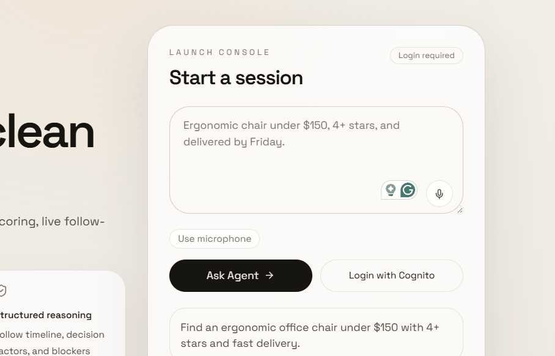
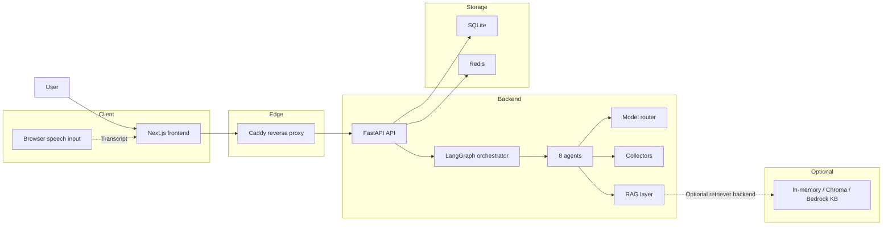
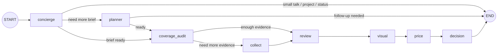
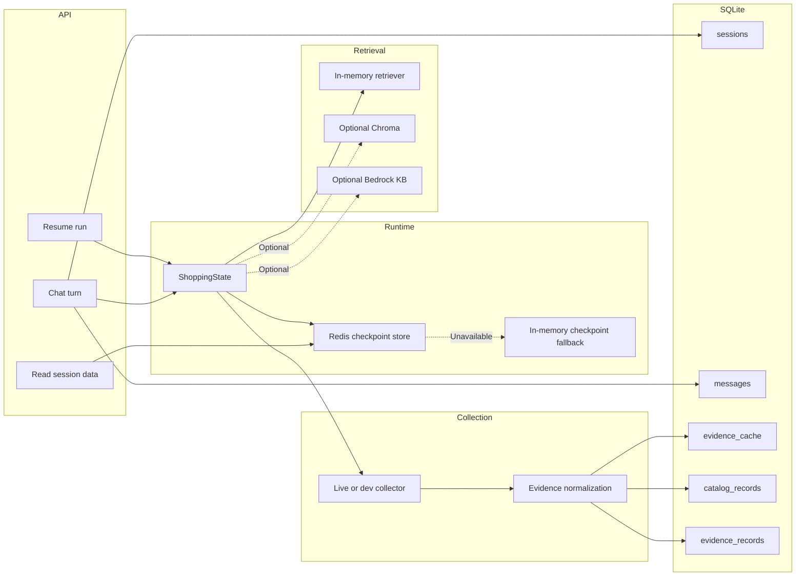

# AgentCart



## Quick Links

- [Why We Built AgentCart](#why-we-built-agentcart)
- [Why Amazon Nova](#why-amazon-nova)
- [Why We Added RAG](#why-we-added-rag)
- [Scoring System (TrustScoringEngine) & Product Assembly](#scoring-system-trustscoringengine--product-assembly)
- [Our Product](#our-product)
- [What AgentCart Does Today](#what-agentcart-does-today)
- [Architecture At A Glance](#architecture-at-a-glance)
- [How Our Agents Work](#how-our-agents-work)
- [Memory, Evidence, And Runtime Snapshot](#memory-evidence-and-runtime-snapshot)
- [Frontend And API At A Glance](#frontend-and-api-at-a-glance)
- [Local Setup](#local-setup)
- [Docker](#docker)
- [Known Limits](#known-limits)
- [References](#references)

## Why We Built AgentCart

Our team is made up of students, that's why when we started getting ready for dorm life, we kept hitting the same problem: buying simple things was not simple at all. We had to compare chairs, desks, supplements, and other essentials across too many tabs:
- one page for price
- one page for shipping
- one page for Reddit opinions
- one page for marketplace reviews
- one page with product images that did not always look trustworthy

The hard part was not only finding products. The hard part was knowing what to trust. Some reviews looked fake, some product images looked AI-generated, some items had high ratings but only a tiny number of reviews, and some products looked cheap at first but became expensive after shipping or weak return policies. We wanted one workspace that could remember our shopping brief, compare products across sources, explain why one option looked safer than another, and say "I still need more evidence" instead of bluffing. 

## Why Amazon Nova

We came up with AgentCart with help from Amazon Nova on the reasoning side. Nova was a good fit for this project because it helped us move fast without making the system feel too heavy: it’s fast enough for back-and-forth shopping sessions, good at short reasoning tasks, strong at pulling structure out of messy user text, and easy to plug into an agent workflow.

## Why We Added RAG

We did not want AgentCart to be just prompt engineering. Reviews are messy and spread across many places, so RAG helps us pull back relevant review context, keep explanations grounded, give the review agent better context, and reuse information across turns.

## Scoring System (TrustScoringEngine) & Product Assembly

We did not want the final score to come from a model's mood. The core logic lives in code, and the goal is simple: rank products fairly even when review counts are very different across items and across sources. Thefore, we needed a way to handle cases like:
- Product A: 5.0 stars, 2 reviews
- Product B: 4.6 stars, 500 reviews

This matters because naïve averages break when sample sizes are very different, and LLM-only scoring can drift toward long or dramatic reviews. Using more conservative statistical methods helps protect against inflated ratings, while cross-source comparison requires one shared scoring logic.

To address this, the scoring engine combines several safeguards: a Bayesian average, a Wilson lower bound, penalties for duplicate reviews and promotional or affiliate-heavy content, evidence coverage gates, and crawl health checks. On top of the statistical core, the system also applies supplement-specific ingredient heuristics.

In the API layer, products are assembled by merging matching offers into a single product card, keeping multiple offers under one canonical product, preferring Amazon as the primary offer when available, and generating pros, cons, and insight cards from normalized review evidence.

Research notes behind the statistical core:

- Jindal and Liu (2008): opinion spam
- Pontiki et al. (2014): aspect-based sentiment
- Kim et al. (2006): review helpfulness
- Wilson (1927): lower-bound confidence interval
- Evan Miller notes: practical ranking formulas
- Akoglu et al. (2016): useful direction for later anomaly work

## Our Product




## What AgentCart Does Today

- Live analysis
- Discovery-only mode for unsupported categories
- Session memory across turns
- Explainable verdicts and score breakdowns
- Product cards with merged offers
- Resume flow from saved checkpoint state
- Text-based voice consult mode
- Safe checkout boundary with stop-before-pay guardrail

## Architecture At A Glance

### System Diagram



### Agent Graph



### State And Data Flow



## How Our Agents Work

| Agent | Main job | Short notes |
| --- | --- | --- |
| `concierge` | Route the turn | Reuse context; ask for confirmation; end early when needed |
| `planner` | Build the brief | Extract constraints; merge old and new details; ask follow-up questions |
| `coverage_audit` | Check current evidence | Look at cache and stored data; decide if collection can be skipped |
| `collect` | Gather fresh evidence | Reuse cached data; run live or dev collection; write data back |
| `review` | Analyze reviews | Pull retrieval context; filter noise; prepare review signals |
| `visual` | Check image evidence | Score authenticity; flag weak or missing visuals |
| `price` | Rank offers | Apply budget tiers; check shipping; add safe handoff signals |
| `decision` | Return the final call | Run trust scoring; return verdict, trace, and diagnostics |

## Memory, Evidence, And Runtime Snapshot

### What lives where

- `sessions`: session metadata
- `messages`: full transcript plus assistant meta
- `evidence_cache`: reusable crawl output by constraints fingerprint
- `catalog_records`: pre-warmed catalog data
- `evidence_records`: normalized product, review, and visual evidence
- Redis: active checkpoint state
- In-memory fallback: backup when Redis is down

### Workspace snapshot on 2026-03-14

| Local store | Count |
| --- | ---: |
| `sessions` | 47 |
| `messages` | 213 |
| `evidence_cache` | 20 |
| `catalog_records` | 1810 |
| `evidence_records` | 700 |
| `agent_memory.sqlite3` | about 14.7 MB |


### Source mix in this snapshot

- Catalog: `amazon=1736`, `ebay=60`, `nutritionfaktory=14`
- Evidence: `amazon=695`, `ebay=2`, `nutritionfaktory=2`, `reddit=1`


## Frontend And API At A Glance

### Frontend surface

- landing page
- results page
- history page
- product detail page
- browser speech input
- verdict and trust cards
- trace and diagnostics panels


### API table

| Route | Use |
| --- | --- |
| `GET /health` | Health check |
| `POST /v1/sessions` | Start a session |
| `GET /v1/sessions` | List sessions |
| `GET /v1/sessions/{session_id}` | Read session state |
| `POST /v1/chat` | Run a chat turn |
| `POST /v1/runs/{session_id}/resume` | Resume a paused run |
| `GET /v1/recommendations/{session_id}` | Read decision output |
| `GET /v1/sessions/{session_id}/products` | Read product cards |
| `GET /v1/metrics/runtime` | Read runtime metrics |
| `GET /v1/metrics/catalog` | Read catalog metrics |
| `POST /v1/voice/consult` | Ask a text-based voice consult question |


## Repo Map

- `backend/`: API, agents, collectors, memory, services, tests, scripts
- `frontend/`: Next.js UI, auth, speech hook, results and product pages
- `deploy/`: EC2 scripts and Caddy config
- `assets/readme/`: README image slots and future demo assets

## Local Setup

### 1. Create the environment

Use the root `.env` file. The full template also lives in `.env.example`.

### 2. Start the backend

```bash
python -m venv .venv
# Windows PowerShell
.venv\Scripts\Activate.ps1
# macOS/Linux
# source .venv/bin/activate

python -m pip install -r backend/requirements.txt
cd backend
uvicorn app.main:app --reload
```

Backend URLs:

- API: `http://localhost:8000`
- Health: `http://localhost:8000/health`

### 3. Start the frontend

```bash
cd frontend
npm install
npm run dev
```

Frontend URL:

- App: `http://localhost:3000`

### 4. Optional warmup

```bash
cd backend
python scripts/warmup_domain_corpus.py --domain supplement --target 1600
python scripts/warmup_domain_corpus.py --domain chair --target 600
python scripts/warmup_domain_corpus.py --domain desk --target 600
```

Legacy supplement-only path:

```bash
cd backend
python scripts/warmup_supplements_catalog.py --target 1600
```

### Setup notes

- `RAG_BACKEND` defaults to `inmemory`
- Chroma and Bedrock KB are optional
- `UI_EXECUTOR_BACKEND` defaults to `mock`
- `STOP_BEFORE_PAY=true` should stay on
- If `AGENT_REQUIRE_AUTH=true`, Cognito must be configured correctly

## Docker

### Local dev stack

```bash
docker compose up --build
```

Services:

- frontend: `http://localhost:3000`
- backend: `http://localhost:8000`
- redis: `redis://localhost:6379`


### Production warmup

```bash
chmod +x deploy/ec2/warmup_catalog.sh
./deploy/ec2/warmup_catalog.sh supplement 1600
./deploy/ec2/warmup_catalog.sh chair 600
./deploy/ec2/warmup_catalog.sh desk 600
```

## Known Limits

- Backend voice is not audio-in
- Voice consult is text in, text out
- Live scraping is brittle
- Review breadth is uneven
- Local data is Amazon-heavy
- `expiresAfterTurn` is not truly enforced yet
- Unsupported categories stay in `discovery_only`

## References

- Evan Miller, Wilson sorting: <https://www.evanmiller.org/how-not-to-sort-by-average-rating.html>
- Evan Miller, Bayesian average ratings: <https://www.evanmiller.org/bayesian-average-ratings.html>
- E. B. Wilson (1927), *Probable Inference, the Law of Succession, and Statistical Inference*
- N. Jindal and B. Liu (2008), *Opinion Spam and Analysis*
- M. Pontiki et al. (2014), *SemEval-2014 Task 4: Aspect Based Sentiment Analysis*
- S.-M. Kim, P. Pantel, T. Chklovski, and M. Pennacchiotti (2006), *Automatically Assessing Review Helpfulness*
